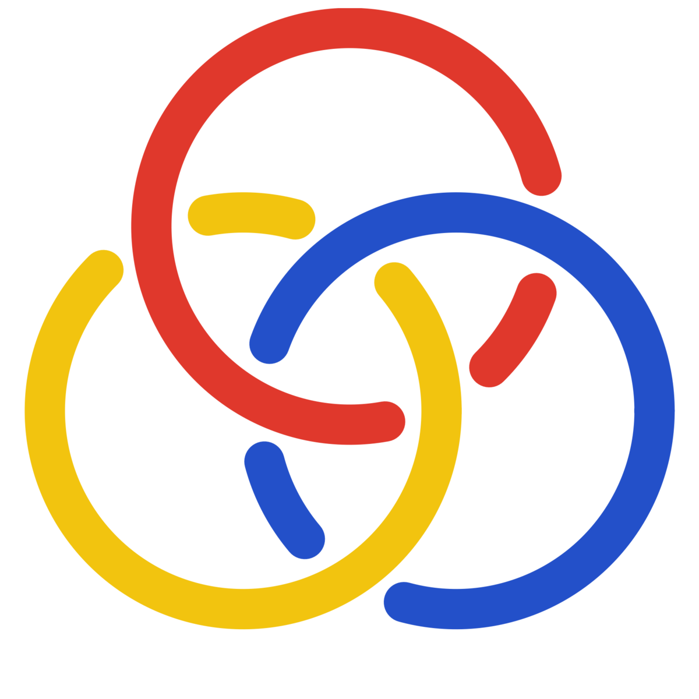

# borromeanRings

<p align="center">
  
</p>

> Like the rings, the gates hold only together: remove any one check and the
> guarantee falls apart.

[](https://github.com/3MagicLabs/borromeanrings/actions/workflows/verify.yml)
[](LICENSE)

A model- and harness-agnostic **meta-harness**: a governing quality layer that
wraps any AI coding agent and enforces engineering standards as **deterministic
gates** — not prompt requests. The agent is an interchangeable worker; the gate
is the product. A change cannot pass until every declared standard is satisfied.

This is **v0**: one repo, one stack (Python), one gate, on Claude Code. borromeanRings
governs its own repo from commit one (it must pass its own gate).

## Run the gate

```bash
./verify.sh        # exit 0 only if every check passes; fail-closed otherwise
```

Each run writes one receipt per check to `.meta-harness/receipts/<run-id>/`, plus
a config cross-check against `borromeanrings.toml`: a required check that never ran (crash/skip) ⇒ overall fail.

## Merge (gated, explicitly requested)

```bash
./merge.sh [base]          # run the gate, then merge immediately if green
./merge.sh --auto [base]   # run the gate, then WAIT for the PR's CI to pass, then merge
```

Run from a feature branch: borromeanRings runs the gate and merges into `base` **only**
if it passes. It executes your merge decision — it never merges on its own. `--auto`
waits for the PR's CI checks too, but is still explicitly invoked per-merge (no
standing, unattended mode). See `docs/adr/0007-gated-explicit-merge.md` and
`docs/adr/0009-command-orchestrated-auto-merge.md`.

## Govern another project (portable, by reference)

borromeanRings can govern *any* project without being copied into it — its code stays here,
the target just references it:

```bash
./init.sh /path/to/your-project       # writes borromeanrings.toml + .claude/settings.json there
# edit your-project/borromeanrings.toml ([project] package/src_dir, required checks, hygiene)
cd /path/to/your-project && /path/to/borromeanrings/verify.sh    # borromeanRings governs it
```

Any agent prompted in that project is now governed (its `.claude/settings.json` hooks
point back at this borromeanRings, and the `borromeanrings-research` skill is installed). `BORROMEANRINGS_HOME`
= where borromeanRings lives; `PROJECT_ROOT` = the project being governed.
See `docs/adr/0013-portability-reference-model.md`, and **`docs/TESTING.md`** for a full
step-by-step way to exercise every feature on a fresh project.

## The checks (v0)

| # | Check | Tool |
|---|---|---|
| 00 | build / importable | `python -m compileall` + import |
| 10 | format | `ruff format --check` |
| 20 | lint | `ruff check` |
| 30 | typecheck | `mypy` (strict) |
| 40 | test + coverage **ratchet** | `pytest --cov` (no absolute % target) |
| 50 | security | `bandit` |

## Layout

- `verify.sh` — the gate (the single source of truth, called by humans, CI, and hooks)
- `checks/` — one script per check under a uniform contract (`borromeanrings.toml` declares the required set)
- `borromeanrings.toml` — the policy spine: declared invariants enforced on every run
- `.claude/` — Claude Code hook **adapters** over the substrate-neutral gate
- prompt rewriting: `.claude/hooks/prompt_rewrite.sh` (UserPromptSubmit) injects a spine-driven rewrite directive; toggle in `borromeanrings.toml`
- `src/`, `tests/` — the governed code
- `docs/MANIFESTO.md` — **the why**: the north star; borromeanRings is the meta-harness (it enhances agent capabilities incl. deep research); the notes/Kernel is a separate product built *with* it
- `docs/VISION.md` — the whole product borromeanRings (the meta-harness) is meant to become
- `docs/ROADMAP.md` — **every harness feature, with status** (plus the separate products built with borromeanRings)
- `docs/` — requirements, architecture, ADRs, test plan, process (CS130-grounded)
- `PLAN-v0.md` — the v0 spec and document hub

## Design

See `docs/` — the `.claude/` hooks are an Adapter over `verify.sh` (what makes
borromeanRings harness-agnostic); checks are a uniform-contract registry; the tool a
check uses and the substrate are module secrets. The gate is a mechanized
Definition of Done.
